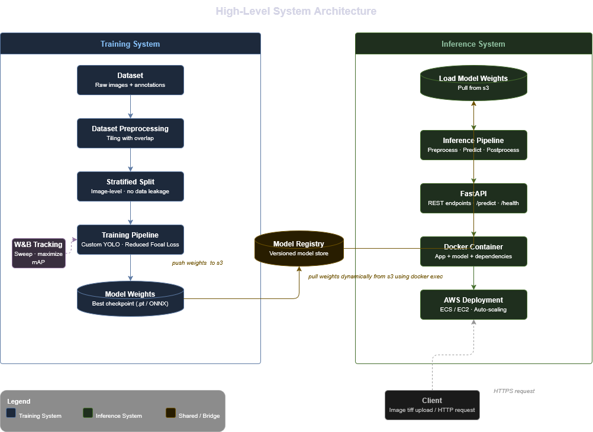

# End-to-End Satellite Imagery Object Detection System


## Project Overview

This project implements an end-to-end satellite imagery object detection system designed to detect multi-scale objects from high-resolution remote sensing imagery using deep learning-based multi-scale object detection techniques.

Satellite imagery introduces several challenges including:
- extreme object scale variation,
- dense object distributions,
- small object detection,
- complex backgrounds,
- and varying environmental conditions.

Beyond model development, a major focus of this project is **building a production-ready inference pipeline** capable of efficiently processing large satellite imagery and **deploying scalable inference services on cloud infrastructure**.

The objective of this project is to bridge the gap between research and real-world application by **not only improving detection performance but also delivering a scalable, deployable, and production-grade object detection pipeline** for large-scale inference workloads.


### Key Features

- Tile-based large image inference pipeline
- Coordinate remapping and global NMS
- multi-scale training and preprocessing strategies
- FastAPI-based inference serving
- Dockerized deployment workflow
- AWS ECR and EC2 cloud deployment
- S3 integration for model weight retrieval and prediction artifact storage
- Production-ready inference architecture

---

## Quick Start

### Clone Repository

```bash
git clone <repo-url>
cd xview-satellite-detection/
```


### Training Pipeline

```bash
cd training/yolo_src/model

python trainer.py --do_training
```


### Inference Pipeline

```bash
cd inference/api
```

Build Docker image:

```bash
docker build -t xview-satellite-api .
```

Run inference container:

```bash
docker run -d -p 8000:8000 xview-satellite-api
```

Access Swagger UI:

```text
http://localhost:8000/docs
```

> **Note:**  
> The training and inference workflows are intentionally designed as separate pipelines.  
> The training pipeline focuses on dataset preparation, model development, and evaluation, while the inference pipeline is optimized for scalable deployment and production serving.


Refer to `docs/deployment.md` for complete environment configuration and AWS setup instructions before running the inference container.

---

<h2>System Architecture</h2>

<p align="center">
  
</p>

---

## Dataset

xView is one of the largest and most diverse publicly available Satellite Imagery object-detection datasets. The classes are organized in a parent-child hierarchy, where parent classes represent broader categories and child classes represent more specific object instances.


[Official xView Website](https://challenge.xviewdataset.org/welcome)
[Official xView Paper](https://arxiv.org/pdf/1802.07856)
[Official xView GitHub Repository](https://github.com/DIUx-xView/xView1_baseline)


| Property          | Value                             |
| ----------------- | --------------------------------- |
| Dataset           | xView                             |
| Task              | Object Detection                  |
| Classes           | 60                                |
| Annotation Format | GeoJSON                           |
| Image Type        | GeoTIFF                           |


#### Why xView?
The dataset was selected after evaluating multiple datasets across domains such as:
- aerial imagery,
- autonomous driving,
- medical imaging,
- and industrial inspection.

Among aerial datasets, xView was chosen over alternatives such as VisDrone due to its:
- extreme object scale variation,
- extreme class imbalance,
- small object detection challenges,
- and strong real-world relevance.

These characteristics make xView well-suited for building and evaluating:
- scalable object detection systems,
- tile-based inference pipelines,
- and production-grade deployment architectures.

The dataset also introduces practical challenges including:
- class imbalance,
- complex backgrounds,
- and high-resolution image processing.


A detailed exploratory data analysis (EDA) was performed to better understand the dataset characteristics, annotation distribution, object scales, image resolutions, and class imbalance patterns.

#### Key Challenges in xView

- **High-resolution imagery** requiring memory-efficient preprocessing and inference strategies
- **Extreme class imbalance** causing uneven learning across object categories
- **Severe object scale variation** ranging from tiny vehicles to large infrastructure objects
- **Dominance of small objects**, making detection highly sensitive to resolution loss
- **Multi-scale detection challenges** due to the coexistence of very small and very large bounding boxes
- **Dense object distributions** in certain images containing thousands of annotations
- **Inconsistent image resolutions and aspect ratios** across the dataset
- **Variable object density per image**, ranging from sparse scenes to highly crowded regions
- **Large-scale GeoJSON annotations**, requiring efficient parsing and preprocessing pipelines 

These challenges strongly influenced the design of both the training and inference pipelines, including:
- tiling-based inference,
- multi-scale training strategies,
- optimized preprocessing,
- and scalable deployment architecture.


Detailed Analysis is available in:
- docs/training_pipeline.md

---

## Folder Structure

```text
xview-satellite-detection/
│
├── README.md
├── .gitignore
│
├── training/
│   ├── yolo_src/
│   │   ├── dataset/
│   │   │   ├── Dataset_Analysis.ipynb
│   │   │   ├── Dataset_Preparation.ipynb
│   │   │   ├── data.yaml
│   │   │   ├── Original/
│   │   │   └── Processed/
│   │   │
│   │   ├── model/
│   │   │   ├── Config.yaml
│   │   │   └── trainer.py
│   │   │
│   │   ├── utils/
│   │   │   └── bbox_utils.py
│   │   │
│   │   └── evaluation/
│   │       ├── inference.py
│   │       └── Evaluate.ipynb
│
├── inference/
│   └── api/
│   │   ├── .dockerignore
│   │   ├── Dockerfile
│   │   ├── Config.yaml
│   │   ├── s3_utils.py
│   │   ├── app.py
│   │   ├── main.py
│   │   └── requirements.txt
│
├── docs/
│   ├── training_pipeline.md
│   ├── inference_pipeline.md
│   ├── deployment.md
│   ├── architecture.md
│   ├── benchmarks.md
│   └── images/
│
├── requirements/
│   ├── training.txt
│   └── inference.txt
│
├── outputs/
│   ├── predictions/
│   ├── logs/
│   └── benchmarks/
│
└── weights/
```

---

## Installation / Dependency Setup

### Training Environment

Install training dependencies:

```bash
pip install -r requirements/training.txt
```


### Inference Environment

Install inference dependencies:

```bash
pip install -r requirements/inference.txt
```

---

## How to Run Training Pipeline

Refer to the detailed training documentation for:
- dataset analysis,
- preprocessing,
- training configuration,
- experiment tracking,
- and model training workflows.

```text
docs/training_pipeline.md
```


## How to Run Inference Pipeline

Refer to the detailed inference documentation for:
- inference workflow,
- tile-based processing,
- FastAPI serving,
- Docker usage,
- and deployment setup.

```text
docs/inference_pipeline.md
```

---

## Hardware Environment

Model training was performed using NVIDIA RTX 3090 GPUs with CUDA acceleration on Vast.ai cloud GPU instances, enabling scalable and cost-aware experimentation for large-scale satellite imagery training workloads.

---


## Deployment

The inference API is containerized using Docker and deployed on AWS EC2 using Amazon ECR for container registry management.

Detailed deployment steps are available in:
- docs/deployment.md

---

## Benchmarking 


Refer to the detailed benchmarks in:

```text
docs/benchmarks.md
```

---

## Sample Results 


---

## Future Improvements


---

## Detailed Documentation 

- [Training Pipeline](docs/training_pipeline.md)
- [Inference Pipeline](docs/inference_pipeline.md)
- [Deployment Guide](docs/deployment.md)
- [Benchmarking](docs/benchmarking.md)

---

